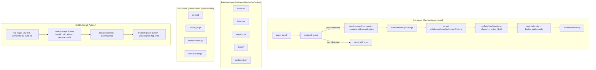
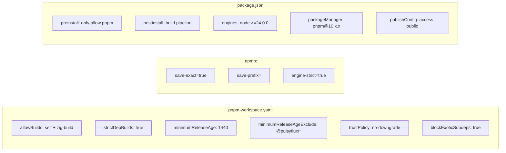

# Design Document: pnpm Migration

## Overview

This design covers the migration of the `@pulsyflux/broker` Node.js package from npm to pnpm, with a focus on supply-chain security hardening, source-distribution packaging, and unified namespace publishing. The migration touches three major areas:

1. **Package manager swap** — Replace npm artifacts with pnpm equivalents, configure pnpm v10's security features (script allowlisting, minimum release age, trust policy, exotic subdep blocking, exact version pinning), and enforce pnpm-only installation.

2. **Source distribution model** — Restructure the published npm package to ship only source files (C++ addon source, build script, registry module, types). Go source is published as a proper Go module at `github.com/pulsyflux/broker` and fetched via `go get` during a consumer-side `postinstall` lifecycle script that compiles both the Go shared library and C++ addon locally.

3. **Unified namespace & CI/CD** — Establish the `pulsyflux` npm org (`@pulsyflux/broker`) and GitHub org (`github.com/pulsyflux/broker`), publish with provenance attestation via OIDC, and create a single GitHub Actions workflow orchestrating Go → Node.js → integration test → publish stages.

### Key Design Decisions

| Decision | Rationale |
|---|---|
| pnpm v10 (not v11) | v10 supports `pnpm.allowBuilds` in `package.json` and `.npmrc` settings; v11 moves settings to `pnpm-workspace.yaml` which changes the configuration surface. The project is a single package, not a workspace. |
| `postinstall` for native build | Consumers compile locally, eliminating pre-built binary tampering risk. Requires Go + C++ toolchain on consumer machine. |
| `allowBuilds` over `onlyBuiltDependencies` | `allowBuilds` (added v10.26) is the current recommended setting; `onlyBuiltDependencies` is deprecated. |
| `pnpm-workspace.yaml` for security settings | pnpm v10.5+ reads `allowBuilds`, `minimumReleaseAge`, `trustPolicy`, `blockExoticSubdeps`, and `strictDepBuilds` from `pnpm-workspace.yaml`. Even for a single-package project, this is the canonical location. |
| `.npmrc` for install-behavior settings | `save-exact`, `save-prefix`, `engine-strict` are `.npmrc` settings. |
| Absolute DLL path only | Removes `LoadLibraryA("broker_lib.dll")` bare-name call entirely; resolves path from addon's own module handle. |
| Go module at repo root | `broker_lib.go` (package main) lives at repo root alongside `go.mod`; `broker/` subpackage contains server/client. Module path becomes `github.com/pulsyflux/broker`. |

## Architecture

The migration produces the following layered architecture:



### pnpm Security Configuration Stack



## Components and Interfaces

### 1. Package Configuration Files

#### `nodejs-api/package.json` (modified)

Key changes from current state:

| Field | Current | After Migration |
|---|---|---|
| `name` | `pulsyflux-broker` | `@pulsyflux/broker` |
| `scripts.preinstall` | (none) | `pnpm dlx only-allow pnpm` |
| `scripts.postinstall` | (none) | `node postinstall.mjs` |
| `engines.node` | `>=14.0.0` | `>=24.0.0` |
| `packageManager` | (none) | `pnpm@10.x.x` |
| `files` | `[".bin/release/", "README.md", "LICENSE", "types/"]` | `["addon.cc", "build.mjs", "registry.mjs", "postinstall.mjs", "types/", "README.md", "LICENSE"]` |
| `publishConfig` | (none) | `{ "access": "public" }` |
| `repository.url` | `https://github.com/marchuanv/pulsyflux.git` | `https://github.com/pulsyflux/broker.git` |
| `dependencies` | (none) | `node-addon-api`, `node-api-headers`, `zig-build` (promoted from devDeps) |
| `devDependencies` | all current deps | `jasmine`, `tsx` only |
| `zig-build` ref | `github:solarwinds/zig-build` | `github:solarwinds/zig-build#<commit-sha>` |

#### `nodejs-api/pnpm-workspace.yaml` (new)

```yaml
allowBuilds:
  '@pulsyflux/broker': true
  zig-build: true
strictDepBuilds: true
minimumReleaseAge: 1440
minimumReleaseAgeExclude:
  - '@pulsyflux/*'
trustPolicy: no-downgrade
blockExoticSubdeps: true
```

#### `nodejs-api/.npmrc` (new)

```ini
save-exact=true
save-prefix=
engine-strict=true
```

#### `nodejs-api/.gitignore` (modified)

Remove `package-lock.json` from ignored files (if present). Ensure `pnpm-lock.yaml` is NOT ignored. Keep `node_modules/`, `.bin/`, and build artifacts ignored.

### 2. Postinstall Build Script

#### `nodejs-api/postinstall.mjs` (new)

A Node.js script that orchestrates the consumer-side build pipeline:

```
postinstall.mjs
├── 1. Check Go version >= minimum from go.mod
├── 2. Fetch Go module: go get github.com/pulsyflux/broker@<pinned-version>
├── 3. Locate fetched broker_lib.go in GOPATH/pkg/mod
├── 4. Build Go shared library: go build -buildmode=c-shared -o .bin/release/broker_lib.dll
├── 5. Build C++ addon: node build.mjs
└── 6. Verify outputs exist: broker_lib.dll, broker_addon.node
```

The pinned Go module version is read from a `goModuleVersion` field in `package.json` (or a dedicated `.go-version` file), making version updates visible in version control.

**Interface:**
- **Input:** Environment with Go (≥1.25), C++ toolchain, Node.js (≥24)
- **Output:** `.bin/release/broker_lib.dll` and `.bin/release/broker_addon.node`
- **Exit codes:** 0 on success, non-zero on any step failure with descriptive error

### 3. Hardened DLL Loading (addon.cc modification)

The current `addon.cc` calls `LoadLibraryA("broker_lib.dll")` as a bare filename first, which is vulnerable to DLL hijacking. The fix:

```cpp
// BEFORE (vulnerable):
hLib = LoadLibraryA("broker_lib.dll");

// AFTER (hardened):
// Resolve absolute path from addon's own location
char addonPath[MAX_PATH];
HMODULE hSelf;
GetModuleHandleExA(
    GET_MODULE_HANDLE_EX_FLAG_FROM_ADDRESS | GET_MODULE_HANDLE_EX_FLAG_UNCHANGED_REFCOUNT,
    (LPCSTR)&Init, &hSelf);
GetModuleFileNameA(hSelf, addonPath, MAX_PATH);
std::string dllPath(addonPath);
size_t pos = dllPath.find_last_of("\\");
if (pos != std::string::npos) {
    dllPath = dllPath.substr(0, pos + 1) + "broker_lib.dll";
}
hLib = LoadLibraryA(dllPath.c_str());
// NO fallback to bare filename
```

### 4. Go Module Restructure

The Go module path changes from `pulsyflux` (local) to `github.com/pulsyflux/broker` (canonical).

**Files affected:**
- `go.mod`: `module pulsyflux` → `module github.com/pulsyflux/broker`
- `broker_lib.go`: `import "pulsyflux/broker"` → `import "github.com/pulsyflux/broker/broker"`
- `broker/client.go`: `import tcpconn "pulsyflux/tcp-conn"` → `import tcpconn "github.com/pulsyflux/broker/tcp-conn"`
- `broker/server.go`: same tcp-conn import update

**Repository layout under `github.com/pulsyflux/broker`:**
```
/
├── go.mod                  (module github.com/pulsyflux/broker)
├── go.sum
├── broker_lib.go           (package main, cgo exports)
├── broker/
│   ├── server.go
│   ├── client.go
│   └── broker_test.go
├── tcp-conn/
│   ├── demux.go
│   ├── logical.go
│   ├── pool.go
│   └── errors.go
├── nodejs-api/             (npm package source)
│   ├── package.json
│   ├── pnpm-workspace.yaml
│   ├── .npmrc
│   ├── pnpm-lock.yaml
│   ├── addon.cc
│   ├── build.mjs
│   ├── postinstall.mjs
│   ├── registry.mjs
│   └── types/
├── test/                   (integration tests)
│   ├── go/
│   └── nodejs/
└── .github/workflows/ci.yml
```

### 5. Preinstall Guard

Uses the `only-allow` package (or inline script checking `npm_config_user_agent`) to reject non-pnpm installs:

```json
{
  "scripts": {
    "preinstall": "pnpm dlx only-allow pnpm"
  }
}
```

When npm runs this, it detects npm in the user agent and exits non-zero. When pnpm runs this (and the package is in the allowBuilds list), it detects pnpm and passes.

### 6. GitHub Actions CI/CD Workflow

#### `.github/workflows/ci.yml`

```yaml
name: CI
on:
  push:
    branches: [main]
    tags: ['v*.*.*']
  pull_request:
    branches: [main]

jobs:
  go:
    runs-on: ubuntu-latest
    steps:
      - uses: actions/checkout@v4
      - uses: actions/setup-go@v5
        with:
          go-version-file: go.mod
      - run: go mod download
      - run: go vet ./...
      - run: go test ./...
      - run: go install golang.org/x/vuln/cmd/govulncheck@latest
      - run: govulncheck ./...
      - run: go build -buildmode=c-shared -o broker_lib.dll broker_lib.go

  nodejs:
    needs: go
    runs-on: ubuntu-latest
    steps:
      - uses: actions/checkout@v4
      - uses: actions/setup-node@v4
        with:
          node-version: 24
      - uses: pnpm/action-setup@v4
      - run: pnpm install --frozen-lockfile
        working-directory: nodejs-api
      - run: node build.mjs
        working-directory: nodejs-api
      - run: pnpm exec jasmine
        working-directory: nodejs-api
      - run: pnpm audit
        working-directory: nodejs-api

  integration:
    needs: [go, nodejs]
    runs-on: ubuntu-latest
    steps:
      - uses: actions/checkout@v4
      - # Run integration tests from test/

  publish:
    if: startsWith(github.ref, 'refs/tags/v')
    needs: [go, nodejs, integration]
    runs-on: ubuntu-latest
    permissions:
      contents: read
      id-token: write  # Required for npm provenance via OIDC
    steps:
      - uses: actions/checkout@v4
      - uses: actions/setup-node@v4
        with:
          node-version: 24
          registry-url: https://registry.npmjs.org
      - uses: pnpm/action-setup@v4
      - run: pnpm install --frozen-lockfile
        working-directory: nodejs-api
      - run: pnpm publish --provenance --access public
        working-directory: nodejs-api
        env:
          NODE_AUTH_TOKEN: ${{ secrets.NPM_TOKEN }}
```

The `id-token: write` permission enables GitHub's OIDC provider to generate the provenance attestation that npm attaches to the published package. The publish stage only runs on version tags (`v*.*.*`) and only after all previous stages pass.

### 7. Integration Test Directory

#### `test/go/` — Go consumer verification
- Creates a temp Go module
- Runs `go get github.com/pulsyflux/broker@<version>`
- Imports and exercises the broker package
- Verifies `go build -buildmode=c-shared` produces a valid shared library

#### `test/nodejs/` — Node.js consumer verification
- Creates a temp directory with minimal `package.json`
- Runs `pnpm install @pulsyflux/broker`
- Verifies postinstall produces `broker_lib.dll` and `broker_addon.node`
- Imports `@pulsyflux/broker` and verifies Server/Client classes work

## Data Models

### Package.json Schema (post-migration)

```json
{
  "name": "@pulsyflux/broker",
  "version": "1.0.0",
  "description": "Node.js bindings for PulsyFlux...",
  "main": ".bin/release/registry.mjs",
  "type": "module",
  "exports": {
    ".": {
      "import": "./.bin/release/registry.mjs",
      "types": "./types/index.d.ts"
    }
  },
  "scripts": {
    "preinstall": "pnpm dlx only-allow pnpm",
    "postinstall": "node postinstall.mjs"
  },
  "files": [
    "addon.cc",
    "build.mjs",
    "registry.mjs",
    "postinstall.mjs",
    "types/",
    "README.md",
    "LICENSE"
  ],
  "dependencies": {
    "node-addon-api": "8.5.0",
    "node-api-headers": "1.3.0",
    "zig-build": "github:solarwinds/zig-build#<commit-sha>"
  },
  "devDependencies": {
    "jasmine": "5.13.0",
    "tsx": "4.21.0"
  },
  "engines": {
    "node": ">=24.0.0"
  },
  "packageManager": "pnpm@10.x.x",
  "publishConfig": {
    "access": "public"
  },
  "repository": {
    "type": "git",
    "url": "https://github.com/pulsyflux/broker.git",
    "directory": "nodejs-api"
  },
  "homepage": "https://github.com/pulsyflux/broker#readme",
  "bugs": {
    "url": "https://github.com/pulsyflux/broker/issues"
  },
  "pnpm": {}
}
```

### go.mod (post-migration)

```go
module github.com/pulsyflux/broker

go 1.25

require github.com/google/uuid v1.6.0
```

### pnpm-workspace.yaml Schema

```yaml
# Security: lifecycle script allowlist
allowBuilds:
  '@pulsyflux/broker': true
  zig-build: true
strictDepBuilds: true

# Security: delay newly published versions by 24h
minimumReleaseAge: 1440
minimumReleaseAgeExclude:
  - '@pulsyflux/*'

# Security: reject trust downgrades (account takeover detection)
trustPolicy: no-downgrade

# Security: block transitive deps from exotic sources
blockExoticSubdeps: true
```

### .npmrc Schema

```ini
# Pin exact versions on add
save-exact=true
save-prefix=

# Reject installs on unsupported Node.js versions
engine-strict=true
```


## Correctness Properties

*A property is a characteristic or behavior that should hold true across all valid executions of a system — essentially, a formal statement about what the system should do. Properties serve as the bridge between human-readable specifications and machine-verifiable correctness guarantees.*

### PBT Applicability Assessment

This feature is primarily a **configuration and infrastructure migration** — the 36 requirements overwhelmingly specify:
- File presence/absence (lockfiles, node_modules, .gitignore entries)
- Configuration field values (package.json fields, pnpm-workspace.yaml settings, .npmrc settings)
- CI/CD workflow structure (GitHub Actions YAML)
- External tool behavior (pnpm's dependency resolution, Go's checksum verification)
- Organizational setup (npm org, GitHub org, 2FA)

The two areas with testable code logic are:

1. **Go version comparison in postinstall.mjs** (Req 31.2) — Parses `go version` output and compares against a minimum. The input space (Go version strings) is large enough for PBT, and the comparison logic should hold as a universal property.

2. **DLL path resolution in addon.cc** (Req 15.1/15.3) — Derives an absolute DLL path from the addon's own location. This is simple string manipulation with a fixed algorithm; a few example-based tests cover the edge cases adequately.

Only the Go version comparison qualifies as a meaningful property-based test. The DLL path resolution and all other requirements are better served by example-based tests, smoke tests, and integration tests.

### Property 1: Go version check correctness

*For any* valid Go version string of the form `go version goX.Y.Z <platform>`, the postinstall version check function SHALL return true if and only if the parsed version (X.Y.Z) is greater than or equal to the minimum required version declared in go.mod.

**Validates: Requirements 31.2, 31.3**

### Property 2: Go version check rejects malformed input

*For any* string that does not match the expected `go version` output format, the postinstall version check function SHALL return false (reject) rather than silently accepting an unparseable version.

**Validates: Requirements 31.2**

## Error Handling

### Postinstall Script Errors

| Step | Failure Mode | Behavior |
|---|---|---|
| Go version check | Go not installed or version too low | Exit non-zero, print required vs actual version |
| `go get` | Network failure, module not found, version tag missing | Exit non-zero, print the `go get` stderr |
| `go build -buildmode=c-shared` | Compilation error, missing CGO toolchain | Exit non-zero, print the `go build` stderr |
| `node build.mjs` | zig-build failure, missing headers | Exit non-zero, print the build stderr |
| Output verification | `.bin/release/broker_lib.dll` or `broker_addon.node` missing | Exit non-zero, print which artifact is missing |

Each step checks the exit code of the child process and propagates failures immediately — no partial builds.

### Preinstall Guard Errors

| Condition | Behavior |
|---|---|
| `npm_config_user_agent` contains `npm` | Exit non-zero, print "Use pnpm to install this package" |
| `npm_config_user_agent` contains `pnpm` | Exit 0, proceed |
| `npm_config_user_agent` missing or unrecognized | Exit non-zero (fail-closed) |

### DLL Loading Errors

| Condition | Behavior |
|---|---|
| `GetModuleHandleExA` fails to resolve addon path | Throw Napi::Error with "Failed to resolve addon path" |
| `broker_lib.dll` not found at derived absolute path | Throw Napi::Error with "broker_lib.dll not found at: <path>" |
| No fallback to bare filename or Windows search order | By design — single `LoadLibraryA` call with absolute path only |

### pnpm Security Feature Errors

| Feature | Trigger | Behavior |
|---|---|---|
| `strictDepBuilds` | Unreviewed package has build scripts | pnpm install exits non-zero |
| `minimumReleaseAge` | Package version published < 24h ago | pnpm install skips that version |
| `trustPolicy: no-downgrade` | Package trust level decreased | pnpm install exits non-zero |
| `blockExoticSubdeps` | Transitive dep resolves to git/tarball | pnpm install exits non-zero |
| `engine-strict` | Node.js version < 24 | pnpm install exits non-zero |
| `--frozen-lockfile` | Lockfile out of date | pnpm install exits non-zero |

## Testing Strategy

### Testing Approach

This migration is predominantly configuration and infrastructure. The testing strategy reflects this:

- **Smoke tests** — Verify configuration files contain the correct fields and values (package.json, pnpm-workspace.yaml, .npmrc, .gitignore, go.mod, ci.yml). These are the bulk of the tests.
- **Example-based unit tests** — Test specific error scenarios in the postinstall script (Go not installed, build failure, missing artifacts) and DLL path resolution edge cases.
- **Property-based tests** — Test the Go version comparison logic across many generated version strings (Property 1 and Property 2).
- **Integration tests** — End-to-end verification that `pnpm install` resolves all dependencies, the postinstall pipeline produces working artifacts, and the published package installs correctly for consumers. Housed in `test/go/` and `test/nodejs/`.

### Property-Based Testing Configuration

- **Library:** [fast-check](https://github.com/dubzzz/fast-check) (JavaScript PBT library)
- **Minimum iterations:** 100 per property
- **Tag format:** `Feature: pnpm-migration, Property {number}: {property_text}`

Each property test targets the version comparison function extracted from `postinstall.mjs`:

```javascript
// Feature: pnpm-migration, Property 1: Go version check correctness
fc.assert(fc.property(
  fc.tuple(fc.nat(2), fc.nat(50), fc.nat(20)),  // major, minor, patch
  ([major, minor, patch]) => {
    const versionStr = `go version go${major}.${minor}.${patch} windows/amd64`;
    const result = checkGoVersion(versionStr, '1.25.0');
    const expected = compareVersions(`${major}.${minor}.${patch}`, '1.25.0') >= 0;
    return result === expected;
  }
), { numRuns: 100 });
```

### Smoke Test Coverage Map

| Requirement | What to verify |
|---|---|
| 1, 2 | `package-lock.json` absent, npm `node_modules/` removed |
| 3 | `pnpm-lock.yaml` exists after install |
| 6 | `pnpm-workspace.yaml` has `allowBuilds`, `strictDepBuilds: true` |
| 8 | `package.json` fields: name, scripts, engines, files, publishConfig, packageManager |
| 9 | `.gitignore` includes `node_modules/`, does not exclude `pnpm-lock.yaml` |
| 11 | `.npmrc` does not contain `shamefully-hoist=true` |
| 13 | `zig-build` dependency has commit hash or tag qualifier |
| 14 | `engines.node` is `>=24.0.0` |
| 18 | `pnpm pack` tarball contains only source files, no binaries |
| 19, 23 | `go.mod` declares `module github.com/pulsyflux/broker` |
| 20 | No `GONOSUMCHECK`/`GONOSUMDB`/`GOFLAGS=-insecure` in scripts |
| 24 | `minimumReleaseAge: 1440` in pnpm-workspace.yaml |
| 25 | `blockExoticSubdeps: true` in pnpm-workspace.yaml |
| 26 | `trustPolicy: no-downgrade` in pnpm-workspace.yaml |
| 27 | `save-exact=true` and `save-prefix=` in .npmrc |
| 28 | CI workflow uses `--frozen-lockfile` |
| 30 | Package name is `@pulsyflux/broker`, repository URLs point to pulsyflux org |
| 32 | `node-addon-api`, `node-api-headers`, `zig-build` in `dependencies` (not devDeps) |
| 34 | CI workflow has Go → Node.js → integration → publish stage ordering |

### Integration Test Coverage

| Test | Location | What it verifies |
|---|---|---|
| Go consumer install | `test/go/` | `go get` fetches module, `go build -buildmode=c-shared` produces valid .dll |
| Node.js consumer install | `test/nodejs/` | `pnpm install @pulsyflux/broker` triggers postinstall, produces artifacts, Server/Client work |
| CI pipeline stages | `test/` | Each CI stage produces expected outputs (via Act for local testing) |
